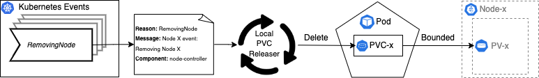

[](https://goreportcard.com/report/github.com/AppsFlyer/local-pvc-releaser)
[](http://www.apache.org/licenses/LICENSE-2.0)


----

Local-pvc-releaser is a Kubernetes controller that improves the efficiency of managing Persistent Volume Claims (PVC) when unexpected node termination occurs by the cloud provider. In cases like this, the Local-pvc-releaser will delete the relevant PVCs as long as they are bounded to a Persistent Volume (PV) that represent a local storage on the faulty node.

Table of contents
=================
<!--ts-->
* [Description](#Description)
* [How it works](#How-it-works)
* [Getting Started](#Getting-Started)
* [Deploying using Helm](Deploying-using-Helm)
* [Observability](#Observability)
* [Contributing](#Contributing)
    * [Local Deployment](#Local-Deployment)
    * [Undeploy controller](#Undeploy-controller)
<!--te-->

## Description
The Local-pvc-releaser controller automate the recovery process for pods incase their associated PVCs is bounded to a PV that represents a local storage drive on a faulty node. <br>
Where previously, manual action had to be taken in order to recover the related pods as their state moved to be "Pending", expecting that the faulty node will recover - Something that will not happen as the faulty node got terminated. <br>
The Local-pvc-releaser take an active action by deleting those PVCs and let the pods create a new one instead. The creation of a new PVC will represent a demand for a new node creation (as long as there are no available resources in the cluster) for the common autoscalers. When the relevant resources will be allocated, the Kubernetes scheduler will schedule the pod and complete the recovery process..

## How it works
The Local-pvc-releaser controller listens to the Kubernetes Node Controller running as part of the cluster control-plane. <br>
The Kuberentes Node Controller is generating "RemovingNode" event upon any node object removal. This is usually happens when you scale down your cluster or if unexpected termination happen to
one of the master/worker nodes. <br>
The Local-pvc-releaser watch those events and reconcile the state of the PVC that are bounded to a PV objects generated from a local storage on the faulty node. <br>
By reconciling (deleting) the needed PVCs, The pod can create a new PVC object and by that, recover as long as there will be available/new resources for him to be scheduled with.<br>

<br>
<p align="center">

</p>

## Getting Started
For deploying this controller, You’ll need a Kubernetes cluster to run against. You can use [KIND](https://sigs.k8s.io/kind) to get a local cluster for testing, or run against a remote cluster (using the current context in kubeconfig).

### Deploying using Helm
Deploying the controller using Helm by:
```console
$ helm repo add local-pvc-releaser https://AppsFlyer.github.io/local-pvc-releaser
$ helm install -n <namespace> <release-name> local-pvc-releaser/local-pvc-releaser
```

For more information, please refer [here](/charts/local-pvc-releaser). 

### Uninstalling the Chart

To uninstall/delete the `local-pvc-releaser` deployment:

```console
$ helm delete --purge local-pvc-releaser
```

## Observability
Local-pvc-releaser controller is publishing the base metrics that are provided by KubeBuilder + additional custom metric indicating about successful PVC deletion and exposed by Prometheus exporter. For more information, please refer [here](/docs/metrics.md).
#### Custom metrics
**`deleted_pvc`**

Labels: `namespace, controller_name, dryrun`
<br>
Description: The number of successful PVC objects that got deleted by the controller

## Contributing
We appreciate and welcome any initiative for improvement. Before raising a PR, Kindly make sure that your code passed all the required CI stages successfully.

#### Local Deployment
Deploy by:
```sh
make deploy
```

Or, Selectively, deploy the controller with different image tag by:
```sh
make deploy IMG=<some-registry>/Local-pvc-releaser:tag
```

#### Undeploy controller
UnDeploy the controller from the cluster:

```sh
make undeploy
```